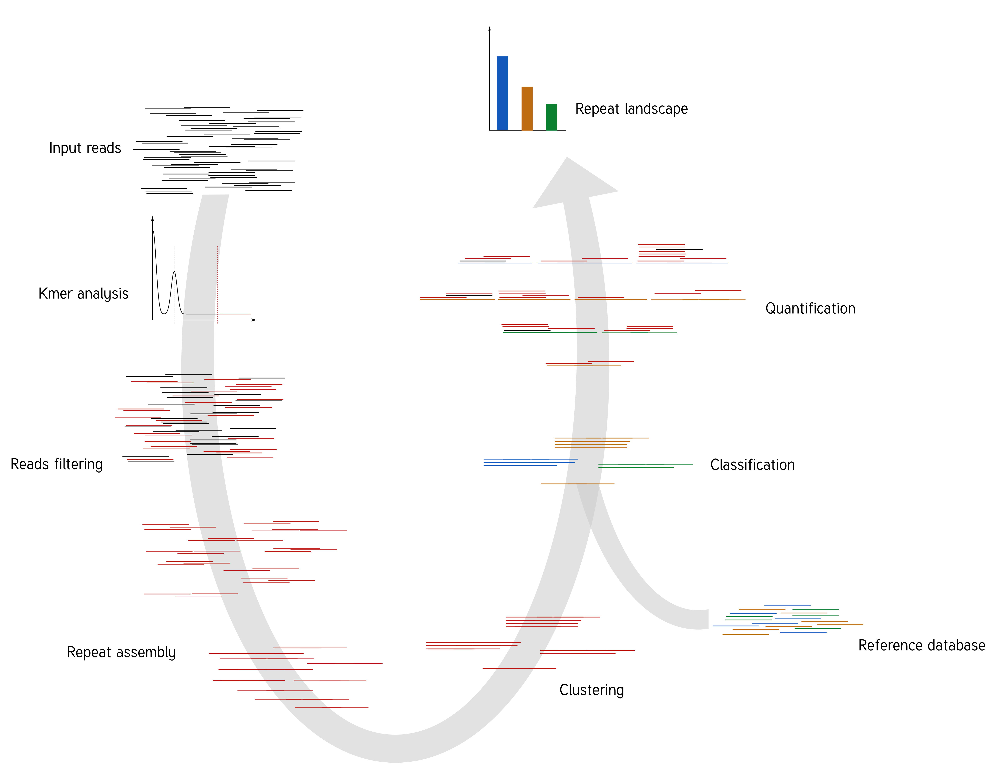

# Summary

Repetitive elements comprise a substantial part of all eukaryotic genomes. While all species contain
these sequences, the amount of them differs widely. For example, the yeast genome contains about 3 %
repeats, Arabidopsis 14 %, human 50 % and wheat 90 % ([@kim_transposable_1998],[@the_arabidopsis_genome_initiative_analysis_2000],[@lander_initial_2001],[@clavijo_improved_2017]).
Identification of these elements is done by searching for typical structures and sequences in the genome
assembly. However, the presence of repetetive elements is a challenge for assembly algorithms, which
leads to an underrepresentation of repeats in a genome assembly. Thus, the annotation of repeat regions based
on an assembly is error prone.

To adress this challenge, we present reper, a kmer based method to detect, classify and quantify repeats
in NGS data without the need of a genome assembly.
Our pipeline samples reads with high kmer coverage using jellyfish ([@marcais_fast_2011]) from the NGS dataset. This subset is 
assembled using the transcriptome assembler Trinity ([@grabherr_full-length_2011]). This ensures that all possible variants of a repetitive
element are reported. The repeats are then clustered using cd-hit ([@li_cd-hit:_2006],[@fu_cd-hit:_2012]) to create exemplar sequences of each repeat
in the genome. The exemplars are classified based on homolgy to known repeats. This is done using multiple blast ([@camacho_blast+:_2009]) searches. Since reper was developed with
plant data, the default classification libraries are REdat ([@nussbaumer_mips_2012]) for repeats and refseq ([@oleary_reference_2016]) for chloroplast and mitochondrial
sequences. The reference database can be changed by the user to accomodate ones need. A configuration script for
the popular, but proprietary database repbase is also provided.
By using read mappings (bowtie2 and samtools, [@langmead_fast_2012] and [@li_sequence_2009]), the repeat content is quantified on sequence, cluster and class level. The resulting
repeat landscapes can then be analyzed by using the supplementary R script provided with the pipeline.

Currently reper is only able to work with paired end Illumina data. Support of long-read technologies
such as PacBio and Nanopore is in developement.

A similar approach is used by dnaPipeTE ([@goubert_novo_2015]). However it is cumbersome to install since it relies on many
dependencies including the RepeatMasker package and the proprietary repeat database repbase by giri.

The reper source code is available on [github](https://github.com/nterhoeven/reper) under the MIT license. For easy installation and usage, a Docker container is
also provided. Since reper is usually run in an HPC environment where users don't have root or
Docker rights, there is also a singularity image available which can be used with normal user permissions.

We are currently using reper to analyze the repeat content in multiple plant genome sequencing projects. An example using *Beta vulgaris* data is given in the tutorial section
of the [reper wiki](https://github.com/nterhoeven/reper/wiki).

# Acknowledgements

We would like to thank Markus Ankenbrand and Frank Förster for valuable discussions and their support and advice on different topics like Docker and pipeline design.

# References